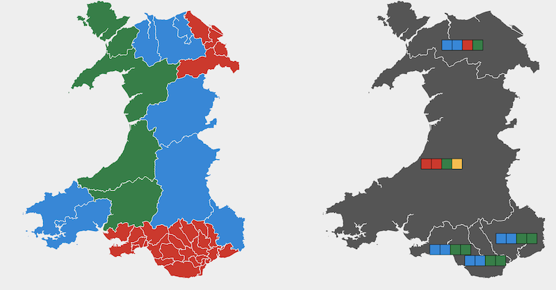

# wales-senedd-2021
Example maps of the Wales Senedd 2021 Election results

## [Choropleth using gradient for split party results in regions](https://martinjc.github.io/wales-senedd-2021/choro-1.html)
This is not a great idea

## [Choropleth using fixed shapes for split party results in regions]((https://martinjc.github.io/wales-senedd-2021/choro-2.html))

## [Fixed area cartogram hexmap]((https://martinjc.github.io/wales-senedd-2021/hex.html))

